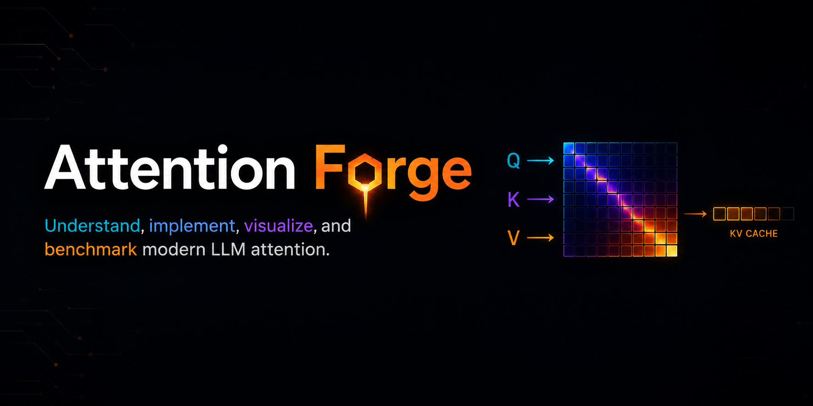
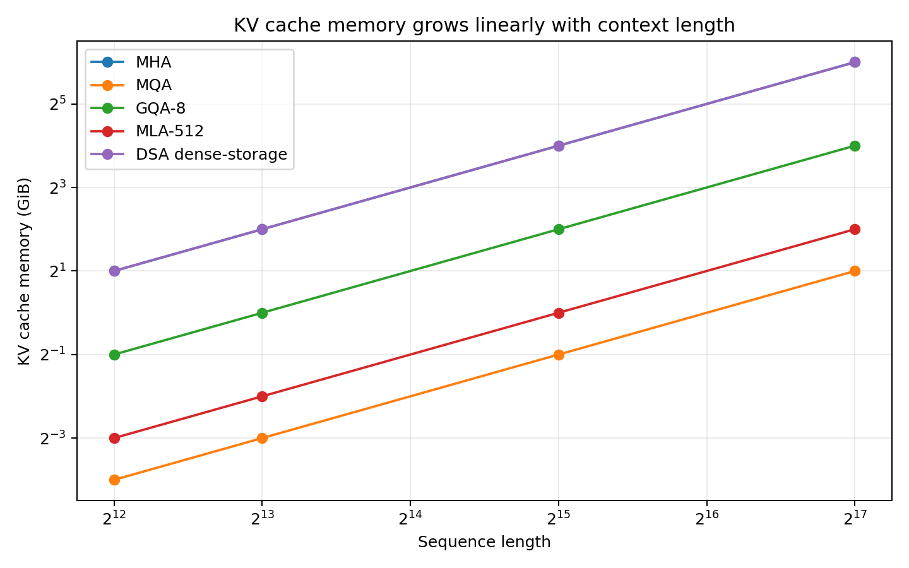
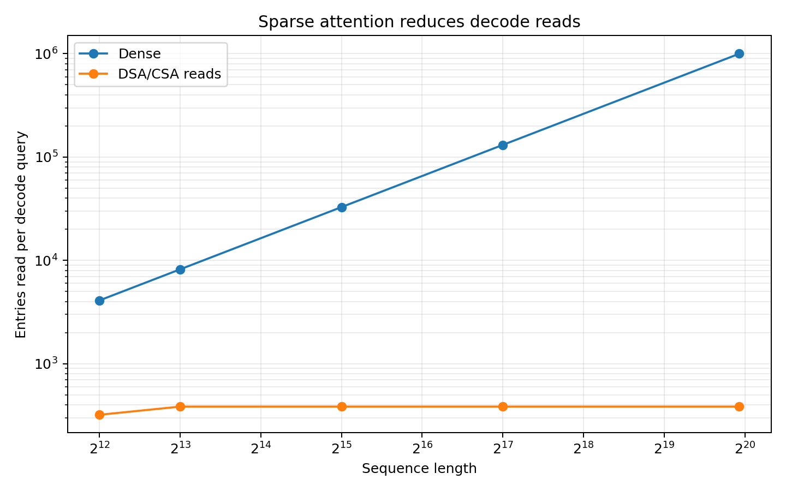

# Attention Forge

**Understand, implement, visualize, and benchmark modern LLM attention.**



Attention Forge is a from-scratch lab for attention mechanisms used in modern
LLM inference, with a strong focus on KV cache, prefill/decode behavior, memory
movement, and attention kernels. The repo focuses on the parts that are hard to
learn from papers and production code alone: tensor shapes, KV-cache growth,
attention variants, sparse selection, compression, and the path from readable
PyTorch to small kernels.

New attention ideas keep arriving. Attention Forge is built to make those ideas
easier to adopt by turning them into self-contained notebooks, tested reference
implementations, benchmarks, visuals, and technical writeups.

This is not a serving engine. It is a learning and implementation lab for
understanding how attention works deeply enough to reason about real inference
systems.

## Scope

The repo is organized around six connected layers:

| Layer          | Purpose                                                            |
| -------------- | ------------------------------------------------------------------ |
| Notebooks      | Build each idea from scratch with minimal dependencies             |
| Reference code | Move stable notebook logic into clean PyTorch modules              |
| Benchmarks     | Measure KV memory, read cost, prefill/decode behavior, and latency |
| Visuals        | Show what attention reads, writes, stores, compresses, and skips   |
| Docs           | Explain mechanisms, implementation choices, tradeoffs, and sources |
| Kernels        | Write small Triton kernels after the reference behavior is clear   |

Each attention variant should answer the same core questions:

- What tensors are projected?
- What gets stored in the KV cache?
- What shape is stored during prefill and decode?
- How much memory does the cache use?
- How many cached entries does each decode query read?
- What does the variant trade off: memory, bandwidth, quality, latency, or
  implementation complexity?

## Attention Variants

The repo focuses on real mechanisms used in modern LLMs or described in model
releases and papers.

| Mechanism                   | Main idea                                                                  |
| --------------------------- | -------------------------------------------------------------------------- |
| Single-head attention       | Baseline attention path using one Q/K/V set and scaled dot-product scoring |
| Multi-Head Attention        | Store separate K/V per query head                                          |
| Multi-Query Attention       | Share one K/V head across many query heads                                 |
| Grouped-Query Attention     | Share fewer K/V heads across groups of query heads                         |
| Multi-Head Latent Attention | Store compressed latent cache state instead of full per-head K/V tensors   |
| Sliding-window attention    | Restrict attention to recent tokens                                        |
| Sink-token attention        | Always keep selected early tokens visible                                  |
| Block sparse attention      | Attend to selected blocks instead of every previous token                  |
| DeepSeek sparse attention   | Select useful prior context before attention reads K/V                     |
| Compressed sparse attention | Compress context into blocks, score blocks, and attend to selected entries |
| MiniMax attention           | Track sparse/linear attention mechanisms from MiniMax source material      |

## KV Cache Lens

KV cache is treated as a first-class part of every variant, not a separate
afterthought.

For each mechanism, the project tracks:

- cache tensor shape
- bytes stored per layer and per model
- bytes written per generated token
- bytes read per decode query
- how MHA, MQA, GQA, MLA, and sparse attention change the cache path
- when memory savings and read savings are different things

This matters because decode-time inference is often limited by memory movement:
every generated token reads old K/V and writes new K/V, and long-context serving
makes that cost visible.

## Learning Path

1. **Attention core**

   - Q/K/V projection
   - head split and merge
   - causal masking
   - prefill vs decode
   - explicit KV cache
2. **Dense attention variants**

   - Multi-Head Attention
   - Multi-Query Attention
   - Grouped-Query Attention
   - prefill/decode equivalence checks
3. **KV-cache memory math**

   - exact byte formulas
   - read/write cost
   - MHA/MQA/GQA/MLA comparison
   - dense vs sparse decode reads
4. **Latent and sparse attention**

   - Multi-Head Latent Attention
   - sliding-window attention
   - sink-token attention
   - block sparse masks
   - DeepSeek-style sparse and compressed sparse attention
5. **Experiments**

   - tiny model tasks
   - synthetic long-context retrieval
   - dense vs sparse success/failure cases
   - quality vs memory/read-cost tradeoffs
6. **Kernel path**

   - memory layout
   - tiny Triton decode attention
   - PyTorch vs kernel comparison
   - explanation of loads, stores, and blocking

## Notebooks

The notebooks are the main learning path. They are self-contained and build the
idea before the cleaned implementation moves into package code.

| Notebook                                | Focus                                                   |
| --------------------------------------- | ------------------------------------------------------- |
| `01A_attention_core_from_scratch.ipynb` | Single-head attention from math to Torch SDPA           |
| `01B_attention_core_triton.ipynb`       | Dot product, matmul, softmax, and masking in Triton     |
| `02A_multi_head_attention_torch.ipynb`  | MHA tensor layout, projection, KV cache, and profiling  |
| `02B_multi_head_attention_triton.ipynb` | MHA kernel shape, blocking, masking, loads, and stores  |
| `03A_multi_query_attention_torch.ipynb` | MQA with shared KV heads and decode-cache savings       |
| `03B_multi_query_attention_triton.ipynb` | MQA kernel layout and reduced KV reads                  |
| `04A_grouped_query_attention_torch.ipynb` | GQA grouping, query-to-KV-head mapping, and cache math |
| `04B_grouped_query_attention_triton.ipynb` | GQA kernel layout and grouped KV reads                |
| `05A_kv_cache_memory_and_decode.ipynb`  | KV-cache memory, read/write cost, and decode behavior   |
| `05B_kv_cache_triton_memory_access.ipynb` | KV-cache loads, memory coalescing, and decode access  |
| `06A_multi_head_latent_attention_torch.ipynb` | MLA-style latent cache and reconstruction path    |
| `06B_multi_head_latent_attention_triton.ipynb` | MLA-style kernel memory path and decode reads    |

## Visual Preview

KV-cache memory grows linearly with context length:



Sparse attention changes how many cached entries a decode query reads:



## Run It

Create an environment:

```bash
python3 -m venv .venv
source .venv/bin/activate
pip install -e ".[dev,notebooks]"
```

Run tests:

```bash
pytest
```

Print memory and sparse-read tables:

```bash
python3 -m examples.benchmark_decode --mode all
```

Regenerate visual assets:

```bash
python3 -m examples.render_visuals --out-dir assets/images
```

Run linting:

```bash
ruff check .
```

## Repository Layout

```text
attention_forge/
  attention/   # Reference attention implementations
  bench/       # Memory, latency, read-cost, and quality experiments
  data/        # Synthetic tasks and tiny corpus helpers
  kernels/     # Experimental Triton kernels
  models/      # Tiny transformer models
  utils/       # Shared utilities
  viz/         # Plots, diagrams, and attention visuals
docs/
  notes/       # Roadmap and design notes
examples/      # Runnable scripts
notebooks/     # From-scratch concept notebooks
tests/         # CPU-first test suite
```

## Roadmap

### 1. Attention Foundations

- single-head attention from scratch
- scaled dot-product scoring
- causal prefill
- token-by-token decode
- explicit KV-cache append/read path
- PyTorch SDPA equivalence checks

### 2. Dense Attention Variants

- Multi-Head Attention
- Multi-Query Attention
- Grouped-Query Attention
- cache-shape and memory comparison
- prefill/decode correctness tests

### 3. Latent Attention

- Multi-Head Latent Attention reference path
- latent cache memory accounting
- reconstruction/projection tradeoffs
- comparison against MHA/GQA cache behavior

### 4. Sparse Attention

- sliding-window attention
- sink-token attention
- block sparse causal masks
- DeepSeek-style sparse selection
- compressed sparse attention over selected blocks
- sparse attention success/failure cases

### 5. Benchmarks And Tiny Models

- prefill vs decode timing
- KV memory and read-cost curves
- synthetic long-context retrieval
- dense vs latent vs sparse quality tradeoffs
- benchmark writeups

### 6. Kernel Experiments

- one small Triton decode-attention kernel
- memory-layout walkthrough
- PyTorch vs Triton comparison
- kernel notes tied back to the reference implementation
